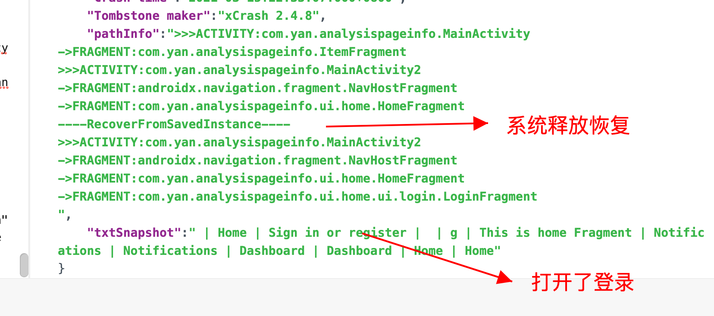

# PathInfo
发生crash或anr后，追加页面跳转路径和TextView界面快照，方便现下复现


```
 // 路径日志 右箭头 跳转到新界面
 // 左箭头 返回
 "pathInfo":">>>ACTIVITY:com.yan.analysispageinfo.MainActivity
             ->FRAGMENT:com.yan.analysispageinfo.ItemFragment
             >>>ACTIVITY:com.yan.analysispageinfo.MainActivity2
             ->FRAGMENT:androidx.navigation.fragment.NavHostFragment
             ->FRAGMENT:com.yan.analysispageinfo.ui.home.HomeFragment
             ->FRAGMENT:com.yan.analysispageinfo.ui.home.ui.login.LoginFragment
             ----RecoverFromSavedInstance---- // 被系统回收 恢复
             >>>ACTIVITY:com.yan.analysispageinfo.MainActivity2
             ->FRAGMENT:androidx.navigation.fragment.NavHostFragment
             ->FRAGMENT:com.yan.analysispageinfo.ui.home.HomeFragment

// textView 文字快照，方便确认数据关系
",
    "txtSnapshot":" | Home | Sign in or register |  | g | This is home Fragment | Notifications | Notifications | Dashboard | Dashboard | Home | Home"
```

